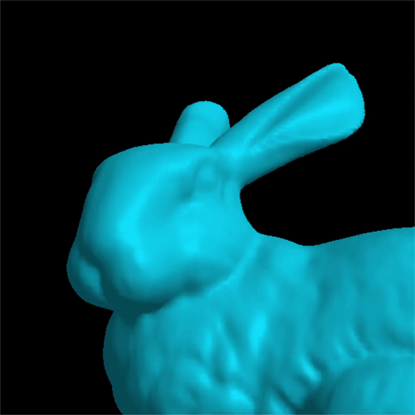
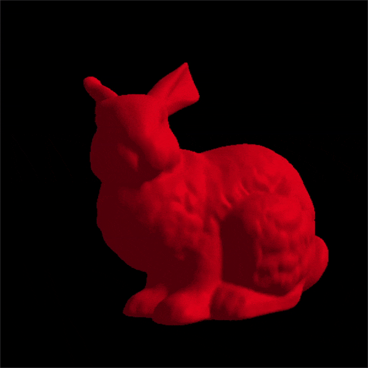

## Overview

This project consists of a 3D model viewer for arbitrary [Wavefront .obj files](https://en.wikipedia.org/wiki/Wavefront_.obj_file), using the OpenGL graphics API. Models are rendered in one window using the simple (but deprecated) OpenGL fixed function pipeline, and in a second window using equivalent GLSL vertex/fragment shaders. Users can control the camera, lighting, and a variety of other rendering properties (see below).

This code was originally implemented as a solo course project in my senior-level Computer Graphics course.

## Features & Controls

The model viewer is keyboard and mouse driven, with the following controls.

+ __Camera:__ translate with _WASD_ keys; rotate with mouse movement; zoom with scroll wheel; tilt with mouse buttons; reset with spacebar:

---

+ __Lighting:__ toggle lighting components with the _L_ key; change light color with _RGB_ keys:

---

+ __Rendering mode:__ toggle between normal rendering, polygon mesh, and point cloud with _123_ keys:

---

+ __Shading mode:__ toggle between flat and smooth (Gouraud) shading with the _P_ key:

---

+ __Clipping:__ change the near/far clipping distances with the _N_ and _F_ keys:

## Dependencies

The model viewer relies on the following libraries:
+ [OpenGL](https://www.opengl.org/)
+ [FreeGLUT](http://freeglut.sourceforge.net/)
+ [OpenGL Mathematics](https://glm.g-truc.net/0.9.9/index.html)

## Acknowledgments

The default model bundled with this repository is based on the [Stanford bunny](https://en.wikipedia.org/wiki/Stanford_bunny).